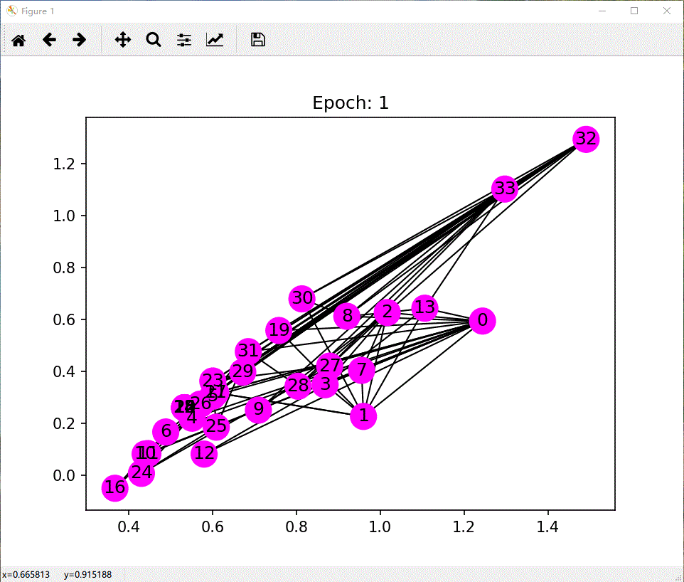

## PyTorch GNNs
> Node-level and graph-level classification.


### Models
Related theory reference 👉🏻 [https://dreamhomes.top/](https://dreamhomes.top/)

- [x] GCN
- [x] GAT
- [x] GraphSAGE
### Dependencies
```shell
numpy==1.20.3
scipy==1.4.1
matplotlib==3.1.3
networkx==2.5.1
torch==1.6.0
dgl==0.5.1

```
Using following command:
```bash
$ pip install -r requirements.txt
```

### Train and visualization
**Karate club dataset**


